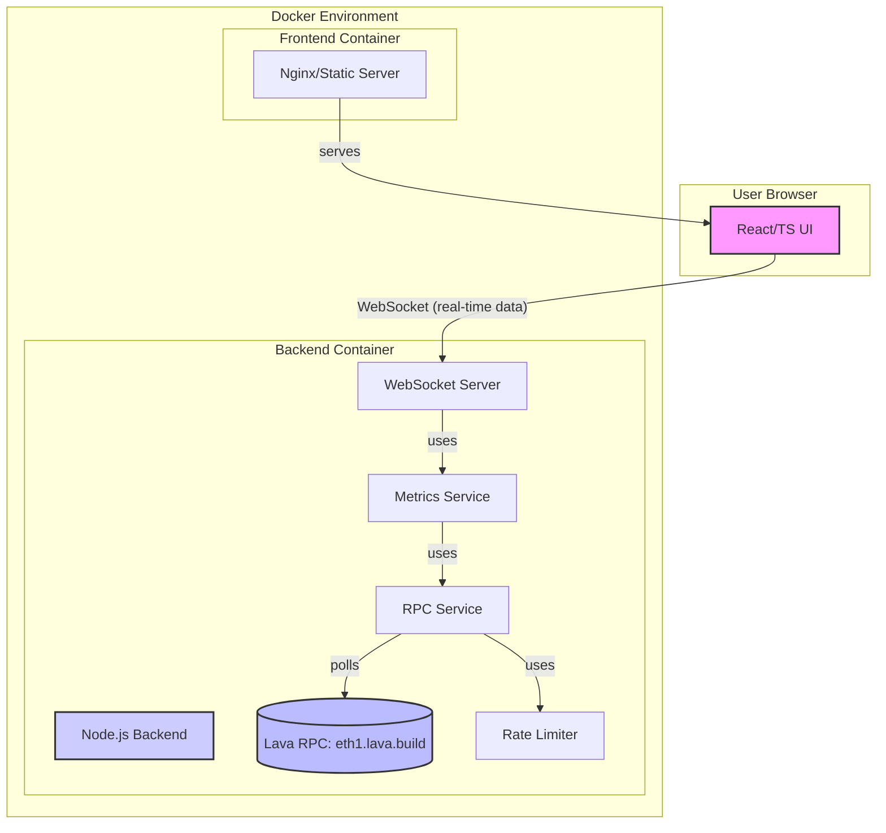

# Lava Network RPC Monitoring Tool - Project Plan

## 1. Overview

This document outlines the development plan for the Lava Network RPC Monitoring Tool. The tool will monitor the health of the public Lava Network RPC endpoint (`https://eth1.lava.build`), track metrics like request success rate and response time, and display these in real-time on a user interface.

The project will be developed as a monorepo using NPM workspaces, containerized with Docker, and will feature a Node.js backend and a React/TypeScript frontend.

## 2. Project Structure

The proposed monorepo structure is as follows:

```
lava-rpc-monitor/
├── agent_docs/                 # AI agent contextual documentation
│   ├── productContext.md
│   ├── activeContext.md
│   ├── systemPatterns.md
│   ├── techContext.md
│   └── progress.md
├── packages/
│   ├── backend/                # Node.js backend service
│   │   ├── src/
│   │   │   ├── services/       # RPC client, WebSocket service, metrics service
│   │   │   ├── utils/          # Rate limiter, helpers
│   │   │   └── index.ts        # Backend entry point
│   │   ├── tests/
│   │   ├── Dockerfile
│   │   ├── package.json
│   │   └── README.md
│   └── frontend/               # React/TypeScript frontend application
│       ├── public/
│       ├── src/
│       │   ├── components/     # React components
│       │   ├── services/       # WebSocket client service
│       │   ├── hooks/          # Custom React hooks
│       │   ├── contexts/       # React contexts (if needed for state)
│       │   ├── App.tsx
│       │   ├── index.tsx
│       │   └── reportWebVitals.ts
│       ├── tests/
│       ├── Dockerfile
│       ├── package.json
│       └── README.md
├── docker-compose.yml          # Docker Compose orchestration file
├── package.json                # Root package.json for NPM workspaces
├── PROJECT_PLAN.md             # This file
└── README.md                   # Main project README
```

## 3. High-Level Architecture Diagram



## 4. Development Phases and Tasks

**IMPORTANT NOTE:** Before making any changes to the frontend or backend packages, please ensure you are operating from the root directory of the monorepo, which is `lava-rpc-monitor/`. This is crucial for NPM workspaces and Docker commands to function correctly.

This plan is broken down into phases to ensure a structured approach. Each task includes a checkbox `[ ]` for tracking progress.
**Important:** After the completion of each task, please review the work. Your explicit approval is required before proceeding to the next task. Upon approval, the task status will be updated from `(Status: Pending)` to `(Status: Done)` and marked with a `[V]`.

### Phase 1: Setup & Core Backend Logic

**Objective:** Establish the monorepo structure and implement the core backend functionalities for RPC communication, rate limiting, and metrics calculation.

1.  **Monorepo Initialization:**
    *   [V] Initialize `npm` project at the root (`lava-rpc-monitor`) (Status: Done).
    *   [V] Configure NPM workspaces in the root `package.json` to include `packages/backend` and `packages/frontend` (Status: Done).
    *   [V] Create the `packages/backend` directory (Status: Done).
    *   [V] Initialize a `package.json` for the backend (`@lava-rpc-monitor/backend`). Include basic scripts (e.g., `start`, `build`, `test`) (Status: Done).
    *   [V] Create the `packages/frontend` directory (Status: Done).
    *   [V] Initialize a `package.json` for the frontend (`@lava-rpc-monitor/frontend`) (Status: Done).
    *   [V] Create initial `README.md` files for root, `packages/backend`, and `packages/frontend` (Status: Done).
2.  **Backend - RPC Client & Rate Limiting:**
    *   [V] **Directory Structure:** Create `src/services/` and `src/utils/` within `packages/backend/src/` (Status: Done).
    *   [V] **Domain (Core Logic):** Define TypeScript interfaces/types for JSON-RPC request/response structures and the metrics data to be collected (e.g., in `packages/backend/src/types.ts` or similar) (Status: Done).
    *   [V] **Infrastructure (RPC Service):** Implement an `rpcService.ts` in `packages/backend/src/services/` (Status: Done).
        *   [V] Use `axios` (or `node-fetch`) to send JSON-RPC requests.
        *   [V] Target RPC: `https://eth1.lava.build`.
        *   [V] Implement functions for initial methods: `eth_blockNumber`, `eth_chainId`.
        *   [V] Handle successful responses and errors gracefully.
    *   [V] **Application (Rate Limiter):** Implement `rateLimiter.ts` in `packages/backend/src/utils/` (Status: Done).
        *   [V] Ensure no more than 300 requests are made per 10-second window.
        *   [V] This utility should be callable before making an RPC request.
    *   [V] **Integration:** Integrate the `rateLimiter` into the `rpcService` to control request frequency (Status: Done).
    *   [V] **Testing (Jest):** (Status: Skipped - Needs revisit)
        *   Write unit tests for `rateLimiter.ts` (e.g., ensure it allows requests under the limit and blocks excess requests).
        *   Write unit tests for `rpcService.ts` (mock HTTP calls using Jest's mocking capabilities to test request formation and response/error handling).
3.  **Backend - Metrics Calculation:**
    *   [V] **Application (Metrics Service):** Create `metricsService.ts` in `packages/backend/src/services/` (Status: Done).
        *   This service will orchestrate the polling of the RPC via `rpcService`.
        *   Implement a polling mechanism (e.g., using `setInterval`) to call RPC methods periodically (e.g., every few seconds, respecting the rate limit).
        *   For each call, track:
            *   Start and end time to calculate response time.
            *   Success or failure status.
        *   Calculate aggregate metrics over a defined window (e.g., last N requests or last M seconds):
            *   Overall success rate (successful calls / total calls).
            *   Average response time for successful calls.
            *   Count of errors (can be a simple count or categorized if time permits).
        *   Store basic error messages/codes from failed RPC calls.
    *   [V] **Testing (Jest):** Write unit tests for `metricsService.ts` (mock `rpcService` to test metric calculation logic under various scenarios like success, failure, and mixed responses) (Status: Skipped - Needs revisit).
4.  **Backend - WebSocket Server:**
    *   [V] **Infrastructure (WebSocket Service):** Create `websocketService.ts` in `packages/backend/src/services/` using the `ws` library (Status: Done).
        *   Set up a WebSocket server that listens on a configurable port (e.g., 8080).
        *   Handle client connections and disconnections.
    *   [V] **Application Integration:** (Status: Done)
        *   The `websocketService` should be able to broadcast data to all connected clients.
        *   `metricsService` should provide its calculated metrics to `websocketService` for broadcasting. This could be done via direct function calls, events, or a shared state managed carefully.
    *   [V] **Main (`packages/backend/src/index.ts`):** (Status: Done)
        *   Create the main entry point for the backend.
        *   Initialize and start all services: `rpcService` (indirectly via `metricsService`), `metricsService`, and `websocketService`.
        *   Handle graceful shutdown if possible.
    *   [SKIP THIS PART] **Testing (Jest):** Write basic unit tests for `websocketService.ts` focusing on connection handling and message broadcasting logic (mocking actual WebSocket connections might be complex for unit tests, focus on the service's internal logic) (Status: Skipped - Needs revisit).

### Phase 2: Frontend Implementation

**Objective:** Develop the React/TypeScript frontend to connect to the backend via WebSockets and display the monitoring data in real-time.

IMPORTANT: make sure you are working in the correct frontend directory which is: /Users/tomelia/myProjects/lava-network-RPC/lava-rpc-monitor/packages/frontend

1.  **Frontend - Project Setup (React + TypeScript):**
    *   [ ] Initialize a new React project with TypeScript in `packages/frontend` (e.g., using `create-react-app my-app --template typescript` or Vite with a React TS template) (Status: Pending).
    *   [ ] Clean up default boilerplate files as needed (Status: Pending).
    *   [ ] Set up basic directory structure: `src/components/`, `src/services/`, `src/hooks/`, `src/contexts/` (if using Context API extensively) (Status: Pending).
2.  **Frontend - WebSocket Client:**
    *   [ ] **Infrastructure (WebSocket Client Service):** Implement `websocketClient.ts` in `packages/frontend/src/services/` (Status: Pending).
        *   Use the native browser WebSocket API (or `socket.io-client` if `socket.io` was chosen for the backend).
        *   Connect to the backend WebSocket server (URL should be configurable, e.g., via environment variables for Docker).
        *   Handle WebSocket events: `onopen`, `onmessage`, `onerror`, `onclose`.
        *   Parse incoming metric messages from the backend.
    *   [ ] **State Integration:** Provide a way for React components to subscribe to and receive data from this service (e.g., using React Context, custom hooks, or a simple event emitter pattern) (Status: Pending).
3.  **Frontend - UI Components & Display:**
    *   [ ] **Presentation (Core Components):** Create basic React functional components in `packages/frontend/src/components/` for displaying metrics. Each component should be simple and focused (Status: Pending):
        *   `BlockNumberDisplay.tsx`: Shows the latest block number.
        *   `ChainIdDisplay.tsx`: Shows the chain ID.
        *   `SuccessRateDisplay.tsx`: Shows the request success rate (e.g., "99.5%").
        *   `AvgResponseTimeDisplay.tsx`: Shows average response time (e.g., "150ms").
        *   `ErrorLogDisplay.tsx`: Displays a simple list of recent error messages.
        *   `StatusIndicator.tsx`: A visual indicator for overall RPC health (e.g., green for healthy, red for issues, based on success rate or recent errors).
    *   [ ] **State Management:** (Status: Pending)
        *   Use React's built-in state management (`useState`, `useEffect`, `useReducer`) or Context API for managing the metrics data received via WebSockets and distributing it to the display components.
        *   Define TypeScript interfaces for the metric data structures used in the frontend state.
    *   [ ] **Presentation (App Layout - `App.tsx`):** (Status: Pending)
        *   Structure the main `App.tsx` component to integrate the WebSocket client setup and arrange the display components in a clear layout.
        *   Ensure data flows correctly from the WebSocket service to the components.
    *   [ ] **Styling:** Implement basic CSS/SCSS styling for readability. (Decision on CSS Modules, Styled Components, or Tailwind CSS can be deferred or kept simple) (Status: Pending).
    *   [ ] **Testing (Jest & React Testing Library):** (Status: Pending)
        *   Write unit/component tests for individual React components to verify they render correctly based on props and handle basic interactions if any.
        *   Test any custom hooks or context providers.

### Phase 3: Dockerization & Integration

**Objective:** Containerize the backend and frontend applications and orchestrate them using Docker Compose for easy deployment and development consistency.

1.  **Docker - Backend:**
    *   [ ] Create `packages/backend/Dockerfile` (Status: Pending).
        *   Use an official Node.js image.
        *   Copy `package.json` and `package-lock.json`, install dependencies.
        *   Copy the rest of the backend source code.
        *   (If using TypeScript, include a build step to transpile TS to JS).
        *   Expose the WebSocket server port.
        *   Define the `CMD` to start the backend application.
2.  **Docker - Frontend:**
    *   [ ] Create `packages/frontend/Dockerfile` (Status: Pending).
        *   Use a multi-stage build approach.
        *   **Build Stage:** Use a Node.js image to install dependencies and build the React application (e.g., `npm run build`).
        *   **Serve Stage:** Use a lightweight web server image (e.g., `nginx:alpine`) to serve the static files produced by the build stage. Copy the build output (e.g., from `build/` or `dist/`) into Nginx's webroot.
        *   Configure Nginx to serve the React app correctly (e.g., handle client-side routing if implemented, though not planned for V1).
        *   Expose the Nginx port (e.g., 80 or 3000).
3.  **Docker Compose (`docker-compose.yml`):**
    *   [ ] Create `docker-compose.yml` in the project root (Status: Pending).
    *   Define two services: `backend` and `frontend`.
    *   **Backend Service:**
        *   Build from `packages/backend/Dockerfile`.
        *   Map ports (e.g., host 8080 to container 8080 for WebSockets).
        *   Set up environment variables if any (e.g., `WEBSOCKET_PORT`).
        *   Ensure it can communicate with the Lava RPC endpoint (network access).
    *   **Frontend Service:**
        *   Build from `packages/frontend/Dockerfile`.
        *   Map ports (e.g., host 3000 to container 80/3000 for the UI).
        *   May depend on the backend service if there are build-time configurations, though typically not for serving static files.
    *   [ ] Define networks if necessary for inter-service communication (though Docker Compose provides a default network) (Status: Pending).
    *   [ ] Optionally define volumes for persistent data if needed (not anticipated for this project's core functionality) (Status: Pending).
4.  **Integration Testing & Refinement:**
    *   [ ] Build and run the entire application using `docker-compose up --build` (Status: Pending).
    *   [ ] Verify that the backend starts, polls the RPC, and serves data via WebSockets (Status: Pending).
    *   [ ] Verify that the frontend connects to the backend WebSocket and displays data correctly (Status: Pending).
    *   [ ] Test the rate limiting by observing backend logs or behavior under load (manual observation initially) (Status: Pending).
    *   [ ] Debug any issues related to container networking, port mapping, or environment variables (Status: Pending).

### Phase 4: Testing, Documentation & Final Polish

**Objective:** Ensure the application is robust, well-documented, and meets all project requirements.

1.  **Comprehensive Testing:**
    *   [ ] Review and improve unit test coverage for both backend (`Jest`) and frontend (`Jest` & `React Testing Library`). Aim for good coverage of critical logic (Status: Pending).
    *   [ ] Perform thorough manual end-to-end testing of all features (Status: Pending):
        *   Correct display of all metrics.
        *   Real-time updates.
        *   Error handling and display.
        *   Behavior when Lava RPC is slow or unresponsive (if testable).
    *   [ ] (Optional, if time permits) Consider adding basic E2E tests using a tool like Cypress or Playwright to automate testing of the user flow. This is likely beyond the scope for an initial version unless specifically requested (Status: Pending).
2.  **Documentation Finalization:**
    *   [ ] Review and update all `README.md` files (root, backend, frontend) with (Status: Pending):
        *   Accurate and clear setup instructions.
        *   Instructions on how to run the application (locally for development and using Docker Compose).
        *   Detailed instructions on how to run tests for each package.
        *   Clear explanation of how to interpret test results (e.g., Jest console output).
    *   [ ] Ensure all deliverables mentioned in the original `instructions.text` regarding documentation are met (Status: Pending).
    *   [ ] Update `agent_docs/` files (especially `progress.md`) to reflect the final state (Status: Pending).
3.  **Final Polish & Refinement:**
    *   [ ] Address any bugs or usability issues identified during testing (Status: Pending).
    *   [ ] Perform a final code review for clarity, consistency, and best practices (Status: Pending).
    *   [ ] Ensure linters and formatters (e.g., ESLint, Prettier) have been run across the codebase (Status: Pending).
    *   [ ] Check for any hardcoded values that should be configurable (e.g., RPC endpoint URL, ports, polling intervals – though for this assignment, defaults are fine if documented) (Status: Pending).

## 5. Next Steps

With this plan in place, the next step is to begin implementation, starting with Phase 1. It's recommended to commit changes frequently and test each component as it's developed. 