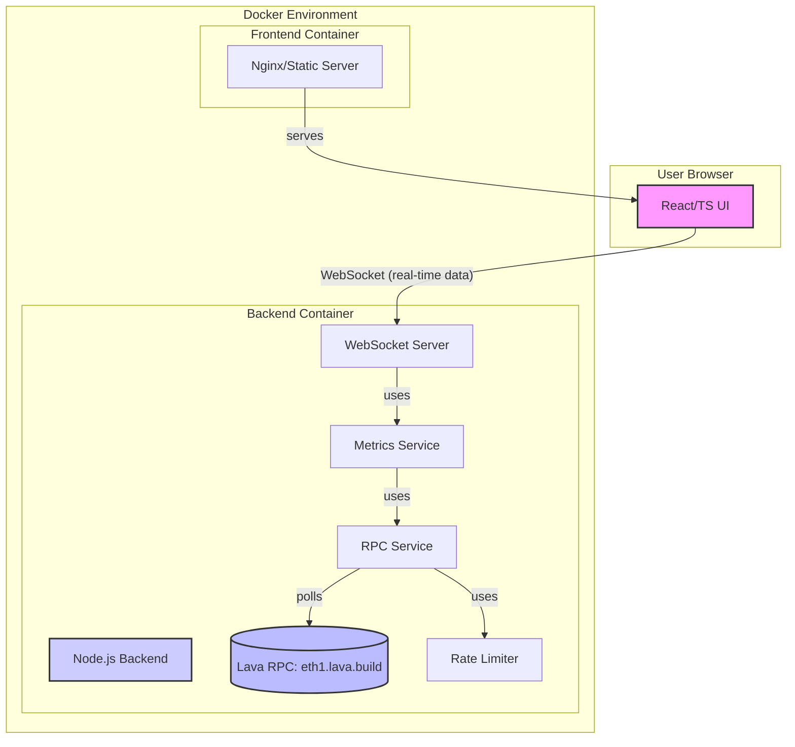

# Lava Network RPC Monitoring Tool - Project Plan

## 1. Overview

This document outlines the development plan for the Lava Network RPC Monitoring Tool. The tool will monitor the health of the public Lava Network RPC endpoint (`https://eth1.lava.build`), track metrics like request success rate and response time, and display these in real-time on a user interface.

The project will be developed as a monorepo using NPM workspaces, containerized with Docker, and will feature a Node.js backend and a React/TypeScript frontend.

## 2. Project Structure

The proposed monorepo structure is as follows:

```
lava-rpc-monitor/
├── agent_docs/                 # AI agent contextual documentation
│   ├── productContext.md
│   ├── activeContext.md
│   ├── systemPatterns.md
│   ├── techContext.md
│   └── progress.md
├── packages/
│   ├── backend/                # Node.js backend service
│   │   ├── src/
│   │   │   ├── services/       # RPC client, WebSocket service, metrics service
│   │   │   ├── utils/          # Rate limiter, helpers
│   │   │   └── index.ts        # Backend entry point
│   │   ├── tests/
│   │   ├── Dockerfile
│   │   ├── package.json
│   │   └── README.md
│   └── frontend/               # React/TypeScript frontend application
│       ├── public/
│       ├── src/
│       │   ├── components/     # React components
│       │   ├── services/       # WebSocket client service
│       │   ├── hooks/          # Custom React hooks
│       │   ├── contexts/       # React contexts (if needed for state)
│       │   ├── App.tsx
│       │   ├── index.tsx
│       │   └── reportWebVitals.ts
│       ├── tests/
│       ├── Dockerfile
│       ├── package.json
│       └── README.md
├── docker-compose.yml          # Docker Compose orchestration file
├── package.json                # Root package.json for NPM workspaces
├── PROJECT_PLAN.md             # This file
└── README.md                   # Main project README
```

## 3. High-Level Architecture Diagram



## 4. Setup and Usage

This section provides instructions on how to set up, run the Lava Network RPC Monitoring Tool, and understand its output.

### Prerequisites

- Docker
- Docker Compose
- Node.js (for local development outside Docker, if preferred)
- NPM (or Yarn)

### Setup Instructions

1.  **Clone the repository:**
    ```bash
    git clone <repository-url>
    cd lava-rpc-monitor
    ```
2.  **Build and Run with Docker Compose:**
    This is the recommended way to run the application.
    ```bash
    docker-compose build
    docker-compose up --force-recreate
    ```
    This command will:
    *   First, `docker-compose build` will build the Docker images for the backend and frontend services.
    *   Then, `docker-compose up --force-recreate` will start the containers, recreating them if they already exist to ensure a fresh start.

### Running the Tool

-   Once `docker-compose up` is successful:
    -   The **Frontend UI** should be accessible at `http://localhost:<FRONTEND_PORT>` (e.g., `http://localhost:3000` if that's the configured port for the frontend service in `docker-compose.yml`).
    -   The **Backend Service** will be running and an API will be available at `http://localhost:<BACKEND_PORT>` (e.g. `http://localhost:8080`).

### How to See and Interpret Results

-   **Real-time Monitoring UI:**
    -   Navigate to the frontend URL in your browser.
    -   The UI will display real-time metrics such as:
        -   **RPC Endpoint Status:** (e.g., Healthy, Degraded, Down)
        -   **Request Success Rate:** Percentage of successful RPC calls.
        -   **Average Response Time:** Average time taken for RPC calls to complete.
        -   **Error Count:** Number of failed requests.
        -   **Request Log:** A live feed or recent history of requests and their statuses.
-   **Interpreting Metrics:**
    -   **High Success Rate (e.g., >99%) and Low Response Time (e.g., <500ms):** Indicates a healthy RPC endpoint.
    -   **Decreasing Success Rate or Increasing Response Time:** May indicate issues with the RPC endpoint or network connectivity.
    -   **Error Count:** Investigate specific errors shown in the log to diagnose problems. The logs might indicate rate limiting, invalid requests, or server-side errors from the RPC endpoint.

### Running Tests

Unit testing is implemented for the backend.

-   **Running Backend Tests:**
    Navigate to the backend directory and run the test script:
    ```bash
    cd packages/backend
    npm test
    ```
    (Assuming `npm test` is configured in `packages/backend/package.json` to run the tests.)

-   **Interpreting Backend Test Results:**
    -   Test runners (e.g., Jest, Mocha, Vitest for backend; Jest, React Testing Library for frontend) will output the results to the console.
    -   **Pass:** All tests passed, indicating the code behaves as expected under test conditions.
    -   **Fail:** One or more tests failed. The output will typically show which tests failed, the specific assertions that were not met, and a stack trace to help locate the issue in the code.
    -   **Coverage Reports:** Test runners can also generate coverage reports (e.g., in an `html` format in a `coverage/` directory) showing which parts of the codebase are covered by tests. Aim for high test coverage.

### Stopping the Application

-   To stop the Docker Compose services:
    ```bash
    docker-compose down
    ```
    If you also want to remove the volumes (useful for a clean restart, but will delete any persisted data if volumes are used for that):
    ```bash
    docker-compose down -v
    ```